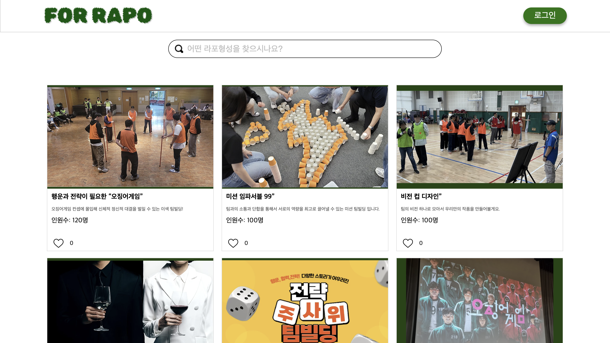
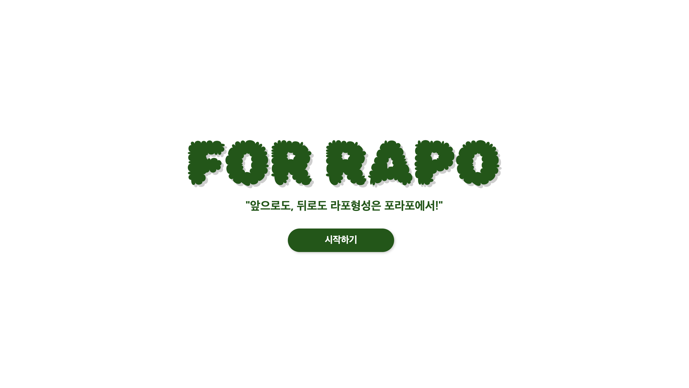
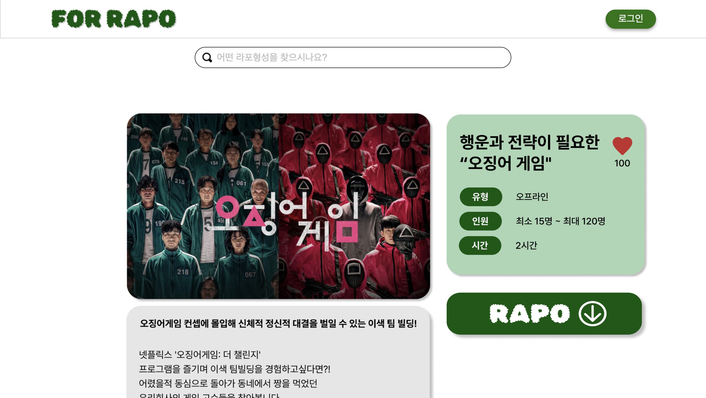

  

<h3 align="center">포라포 (For Rapo)</h3>

  

    For Rapo, 포라포는 라포 형성의 고민을 덜어줄 아이스브레이킹/레크레이션 솔루션입니다.
         
            <a href="https://github.com/Club-PARD/Record_ON_BE/blob/main/README.md"><strong>Explore the docs »</strong></a>
         
     
  

# 📗 Table of Contents

- [Introduction](#-Introduction)
- [As is](#As-is)
- [To be](#To-be)
- [Member](#Member)
- [Page](#Page)

# 📖 Introduction 
### 서비스명: For Rapo
> 💡 **Problem Definition:** For Rapo, 더 나은 팀워크를 위해 라포 형성을 제공하는 웹 플랫폼 입니다

### For Rapo를 통해 이를 해결하고자 합니다

# As-is: 
##### 정보를 찾으려면 여러 사이트를 방문해야 하고, 각각의 게임에 대한 효과와 진행방법을 비교하기 어렵다.
##### 레크레이션을 통해 얻을 수 있는 효과나 적합성을 판단하기 위한 기준도 부족하다.
##### 템플릿을 준비하는 데 시간이 오래 걸려서, 결과적으로 준비된 게임이 오히려 외면받는 경우도 많다.

# To-be:
##### 다양한 아이스브레이킹/레크레이션 방법과 템플릿을 한곳에 모아, 사용자가 시간 을 절약하고 쉽게 선택할 수 있다.
##### 각 게임의 효과와 활용 사례를 제공해 명확한 선택 기준을 만들어준다.
##### 즉시 사용할 수 있는 템플릿을 제공해 준비 과정을 단축하고 실행 가능성을 높입니다."

 
### 즉, 포라포는 이러한 문제들을 해결하고 더 나은 팀워크 형성을 돕는 솔루션입니다.

# Member

<table style = "text-align : center; width:100%;">
<tr>
   <th>최수원</th>
   <th>장주영</th>
   <th>이수인</th>
      <th>유수민</th>
   <th>김우현</th>
   <th>김세현</th>
</tr>
<tr>
   <td>기획/PM</td>
   <td>디자인</td>
   <td>벡엔드</td>
      <td>프론트엔드</td>
   <td>프론트엔드</td>
   <td>프론트엔드</td>
</tr>
</table>

# Page
-  Main Page
  

  - 기능: 메인 화면에서는 다양한 아이스브레이킹과 레크레이션 방법을 카테고리별로 정리해 제공합니다
  - 주요 기술: component 재사용 (Appbar, Card), 클백 연결로 데이터 처리
-  Login Page
  

  - 기능: 로그인을 위한 페이지 구성으로, 아이디 및 비밀번호를 입력하고 데이터를 받습니다.
  - 주요 기술: useState() 함수를 사용해 페이지 이동 처리
-  Register Page
  

  - 기능: 회원가입을 위한 페이지 구성으로, 닉네임, 아이디 및 비밀번호를 입력하고 데이터를 저장합니다.
  - 주요 기술: API를 사용해 post 기술 구현 및 데이터 서버 처리 
-  lendering Page
  

  - 기능: 웹 사이트를 방문할 때 보게 되는 페이지로 구성되어 있습니다.
-  Detail Page
  

  - 기능: 상세 페이지에서는 게임별로 간단한 설명, 게임 효과, 진행 방법, 활용 팁이 제공됩니다.
  - 주요 기술: 스크롤 기능을 이용한 게임별 설명 페이지 구현, pdf 링크 다운 기술 활용 예정 (미완성)

(<a href="#readme-top">back to top</a>)

 

<!— Footer banner —>

